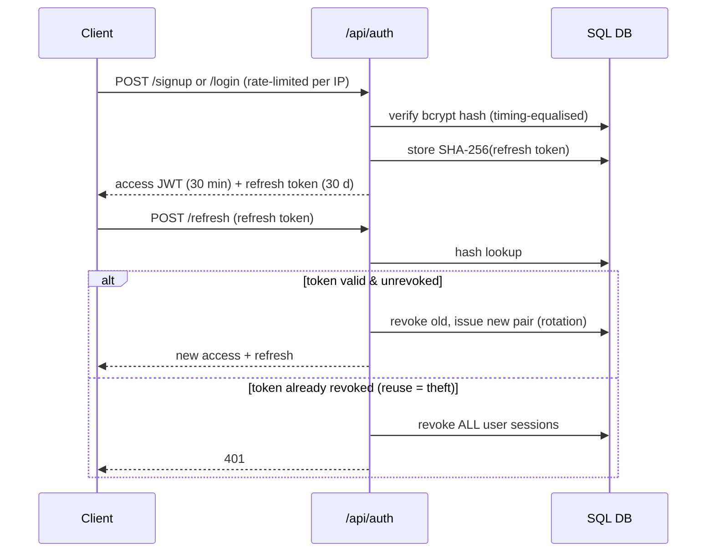
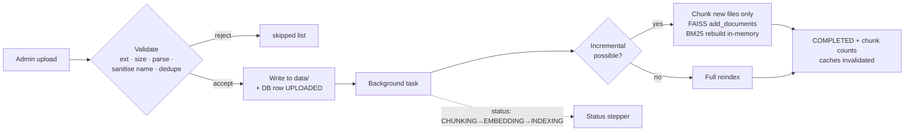
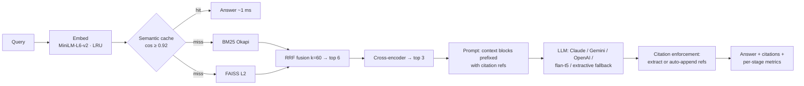
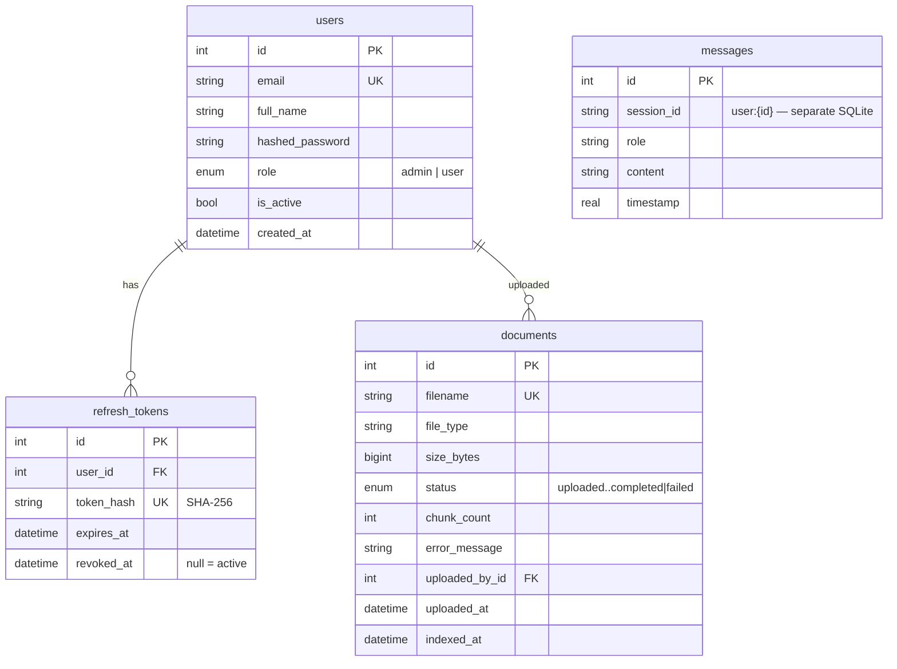
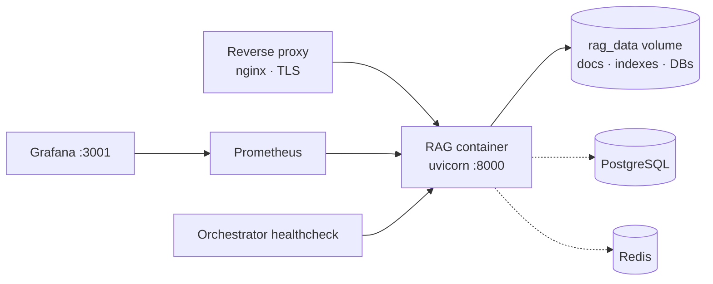

# System Design

## Architecture

```mermaid
graph TB
    subgraph Client
        UI[Dashboard SPA<br/>static/]
    end

    subgraph "FastAPI service"
        MW[Prometheus middleware]
        AUTH[/api/auth/*]
        CHAT[/api/chat]
        LIB[/api/library/*]
        DBG[/api/debug-retrieve]
        EVAL[/api/evaluate]
        HEALTH[/api/health]
        METRICS[/metrics]
    end

    subgraph "RAG pipeline (singletons)"
        CHAIN[RAGChain]
        RET[HybridRetriever<br/>FAISS + BM25 + RRF]
        RER[Cross-encoder reranker]
        SC[SemanticCache]
        LLM[LLM: Claude / Gemini /<br/>OpenAI / local flan-t5]
    end

    subgraph Storage
        SQL[(SQL DB<br/>users, tokens, documents)]
        CHATDB[(chat_history.db)]
        FS[data/ + vectorstore/]
        REDIS[(Redis — optional,<br/>auto-fallback to memory)]
    end

    subgraph Monitoring
        PROM[Prometheus]
        GRAF[Grafana]
    end

    UI --> MW --> AUTH & CHAT & LIB & DBG & EVAL
    CHAT --> CHAIN --> SC & RET --> RER --> LLM
    AUTH --> SQL
    LIB --> SQL & FS & RET
    CHAT --> CHATDB
    RET --> FS
    SC -.-> REDIS
    RET -.-> REDIS
    AUTH -.-> REDIS
    PROM --> METRICS
    GRAF --> PROM
```

## Authentication flow



First account created becomes admin. `CurrentUser` / `AdminUser` FastAPI
dependencies enforce authentication and RBAC on every protected route.

## Upload & indexing pipeline



Deletes remove only that file's vectors (`FAISS.delete` by docstore id) and
rebuild BM25 from the in-memory chunk list; a full rebuild remains the
fallback for any state the fast path can't handle (placeholder index, last
document, errors).

## Chunking

Markdown → header-aware split (section names preserved for citations) →
recursive split to ~500 chars, 50 overlap. Page numbers estimated at ~2000
chars/page (native pages for PDFs). Each chunk carries
`source`, `section`, `chunk_id` (`filename_N`), `page`.

## Retrieval → rerank → citation



Both caches key on the retrieval index generation — any reindex invalidates
them. With `REDIS_URL` set, the retrieval cache gains a shared TTL-bounded L2
and the semantic cache persists to Redis instead of a pickle file.

## Database schema



`users`/`refresh_tokens`/`documents` live in `DATABASE_URL` (SQLite →
PostgreSQL via env; Alembic migrations). `messages` is a local SQLite file.

## Deployment architecture



Solid lines are the minimal single-node deploy (`docker compose up`);
dashed components are opt-in via env (`DATABASE_URL`, `REDIS_URL`) and the
monitoring overlay (`docker-compose.grafana.yml`). See
[DEPLOYMENT.md](DEPLOYMENT.md).
